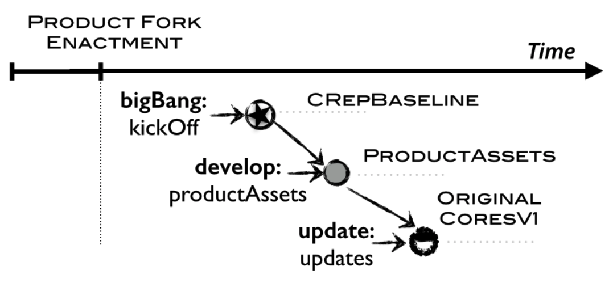

# Tuning GitHub for SPL development: branching models & repository operations for product engineers

## 3. PROPOSALS FOR VCS IN SPLS

VCS (Version Control Systems) は、分散型の共同開発のための礎となるものです。SPL (Software Product Line) は、再利用による共同開発を促進します。伝統的に、共同開発は、同じコードで作業する異なるユーザに適用されます。これは、SPL は、ドメイン・エンジニアリングとアプリケーション・エンジニアリングの2つの領域を設定し、そこでの共同開発は同期によって進行します。2つの領域が分離されているという事実は、誰が、いつ、どのような変更を行ったのかを追跡することをさらに重要にします。SPL のケースのように、開発がそれぞれの予算と責任を持って異なるビジネスユニットに分散している場合、貢献の証明が鍵となることがあります[5]。

VCS は、誰が何をしたかを追跡するために特別に設計されています。大まかに言えば、VCS は「リビジョン」をサポートしています。つまり、開発ライン（ベースラインやトランクと呼ばれる）とそこからの分岐をサポートしています。ブランチをマージすることで、バラバラの作業を再統合することができます。さらに、リポジトリを「フォーク（fork）」することもできます。これにより、リポジトリ全体が分離された空間にクローンされます。ブランチとは異なり、フォークは元のリポジトリから独立しています。元のリポジトリが削除された場合でもフォークは残ります。このスペースは pull request でマージすることができます。この fork & pull モデルは新たに開発に貢献する人たちの間の摩擦を減らすことができます。このモデルがオープンソースプロジェクトの間で人気があるのは、事前に調整することなく独立して作業することができるからです。VCS はファイル構造やブランチやマージのタイミングを指示しないことに注意してください。これは、ブランチング・モデルの役割です。ブランチング・モデルは、VCS を通して運用される依存関係に大きく依存します。

SPL の話に戻りますが、SPL の開発に直面した場合、アプローチは大きく分けて２つの方法があります。既存プロダクトからの分離である抽出（extractive）モデルと、スクラッチからの分離であるプロアクティブ（pro-active）モデルです。次の段落では、この2つのシナリオに対する解決策を掘り下げていきます。

### 抽出シナリオ（Exgtractive Scenario）
既存の製品を Clone&Own で新製品を得るシナリオです。ブランチング・モデルとして、2つのモデルが提案されています。

#### branch-per-product-customer [19]
メインブランチは、すべての製品で共有されるコードを管理します。製品のバリアントはメインブランチから分岐して、顧客ごとに1つのブランチとなり、顧客固有の変更が行われます。
#### branch-per-product-functionality [3]
製品が持っている機能ごとにメインブランチが1つ存在します。製品のバリアントは、機能ブランチをマージすることで得られます。

これらの論文著者自身が認識しているように、これらのアプローチは拡張性に乏しく、コードの効果的な再利用を考慮していません。クローン＆所有（Clone&Own）の実践に沿って、Fisher ら [9] は、異なるプロダクトから必要になる機能部分を必要に応じてマニュアルでピックアップすることでプロダクトのバリアントを得ることを提案しています。Rubin et al. [17] は、密接に関連することとして、VCS はプロダクトの変更が derive されたプロダクトのバリアントに波及して影響することになると考慮しています。

### プロアクティブ・シナリオ（Pro-active Scenario）
再利用とのためのコア資産とそれを利用するプロダクトを区別するモデルです。VCS における賢明な２つのアプローチが提案されています。

#### 単一 (single) リポジトリ
コア資産とプロダクトは同じリポジトリで管理されます。ブランチングによって、コア資産と derive したプロダクトとの間のトレーサビリティを維持します[10]。デメリットは、ブランチはコア資産とプロダクトの両方を管理することです。これらの異なる種類の成果物が、異なるライフサイクルに沿って異なるチームによって管理されている場合、同じ空間を共有することが問題になる可能性があります。また、拡張性も問題になるかもしれません。ここで、Anastasopoulos [2]は、SPL の成果物を特定できる（VCS のどこにあるのかを特定できる） Subversion のツールを紹介しており。エンジニアは変更伝播 (update progapation) を含む進化をコントロールしながら関連した活動を行うことができます。更新伝播は AE (Application Engineering) によって単一のコア資産インスタンス上で実行されます。フィードバック提案は、DE (Domain Engineering) によって単一のコア資産に伝わります。この操作は、すべてのコア資産インスタンスをコア資産にマージします。これは、すべてのインスタンスが DE に組み込まれるために必要となる変更が完了することを待つことを前提としているので、不便な面があります。

#### 分離 (separate) リポジトリ
コア資産とプロダクトは、派生リンク (derivation link) [20]を介して結び付けられた別々のリポジトリで管理されます。Anastasopoulos とは異なり、Thao ら[20]は既存の VCS の再利用を考慮していません。代わりに、彼らはプロダクトとコア資産間の依存関係を確立することができる自作の VCS を構築しています。新たにプロダクトを derive するたびに、コア資産リポジトリに新しいブランチが自動的に作成されます。このブランチは、プロダクト・リポジトリのメインブランチを参照するとともに、変更伝播のためにコア資産にも変更を伝えます。DE が何かを変更した場合、これは更新伝搬になるので、更新伝播は、DE がプロダクト・リポジトリの資産をオーバーライドすることを許可しているといえます。しかし、これはリスクが高いと思われ、スケーラビリティも問題になるかもしれません。

私たちの作業は、既存の VCS ツール（私たちの場合は GitHub）を利用するという点では Anastasopoulos に倣っています。Thao らと同様に、私たちも2種類のリポジトリを提唱しています。コア資産リポジトリとプロダクト・リポジトリです。図１は、このリポジトリ・アーキテクチャに沿って配置されたサンプル SPL を示しています。各リポジトリは分離して設置され、それぞれのチームが管理しています。しかし、SPL のリポジトリは相互に関係しないように分離（isolate）されているわけではなく、同期 (sync) パス（図１の点線で示されています）を介して緊密に結ばれたエコシステムとなっています。残念ながら、リポジトリ間の操作は、これまでのところ fork & pull モデルに限定されています。fork でリポジトリ全体をクローンして新しいリポジトリを作成し、それを pull でマージするまで独立して進化させます。これはオープンソフトウェア・プロジェクトには適していますが、SPL には不向きです。本稿では、再利用は全体のクローンではなく、必要なコア資産をマニュアルでピックアップした後に変更を加えるという derivaion を前提としています。この前提で、名前の由来となっている操作に基づいた derive & update & feedback モデルを紹介します。fork とは異なり、derivation は全体のクローンを作るのではなく、コア資産の必要な部分をピックアップすることになります。同じように、GitHub の pull とは対照的に、update & feedback は、プロダクト・リポジトリとその大元のコア資産リポジトリ間の変更を加えた部分だけの同期を行います。次のセクションでは、ブランチング・モデルについて掘り下げていきます。

## 4. BRANCHING MODELS

VCS は **revisions** をサポートします。つまり、ベースラインから枝分かれした開発ライン（baseline または trunk）を持ち、１本または複数の並行した開発ライン（ブランチしたもの中の **mainlines**）がベースラインから分岐するように可視化されたブランチを形成します（図１を参照してください）。問題は、「並行した開発ライン」という観点から、SPL 開発の手法をどのように模倣するか、つまり分岐モデルを設定するかです。プロダクトはコア資産から drive され、コア資産はスクラッチから、もしくは既存のプロダクトから抽出して作られことから、コア資産とプロダクトは同じではないと考えられるため、別個のブランチング・モデルの方がより良いサービスを提供できると考えています。

### 4.1 A Branching Model For Core Assets

単一製品の開発では、一般的なアプローチは branch-per-pupose [21]である。この方法では、タスクの種類ごとに異なるブランチタイプをつくることを推奨しています。一般的な Git のブランチング・モデルには、master、develop、digression、release のようなブランチタイプがあります [1]。理解のために、ここではこの用語を使います（図2の上部を参照してください）。

* Master ブランチは、コア資産のリリース管理を目的とした長寿命のブランチです。Master ブランチに含まれる各コミットは、一緒に動作するコア資産の安定したリリースとなっています（例えば、Baseline 1.0 では、CA1 から CA10 までのコア資産で構成されています）。このブランチは、アプリケーションエンジニアにとって必須のブランチであり、プロダクトを devive して開発する際の基礎となります。
* Develop ブランチは、コア資産開発のメインラインとして機能する長寿命ブランチです。
* Digression（脱線）ブランチは、コア資産の並行開発や、新しいコア資産の作成、既存資産のコア資産への採用などのために使う短命のブランチです（例えば、updateCA2 ブランチは CA2 コア資産をアップデートするためのものです）。
* Release ブランチは、コア資産におけるベースラインの次のリリースを準備するために使う短命のブランチで、Master にマージする前に使われます（例えば、release:release2.0 ブランチ）。

このアプローチは、Develop ブランチと Digression ブランチによって、単一の共同開発の下で並行して一貫したコア資産開発を可能にします。さらに、プロダクトはコア資産の整合のとれたリリース（ Master ブランチでリリースされたベースライン）を使って開発することができます。このモデルでは、すべてのコア資産が定期的な間隔で一斉に利用可能になるというリリース戦略を採用しています。これは、アプリケーションエンジニアにとっては待ち時間が発生する可能性があることになります。つまり、あるコア資産の実装が終わり本番に向けて準備できていたとしても、他のコア資産が次のベースラインリリースのための準備ができていなければリリースすることができません。この待ち時間があるために、プロダクトエンジニアは、自分たちのニーズに合わせた最適な資産をクローンして自分たちで所有 (Clone&Own) してしまう可能性があります[14]。適切なリリースのペースを検討ことは SPL の組織次第になります。

### 4.2 A Branching Model For Product Repositories

コア資産とは異なり、プロダクトは他の成果物、すなわちコア資産から derive されたもので、プロダクトとコア資産の間に依存関係があるということです。プロダクトは使用しているコア資産との間に依存関係があるということができます。注意してほしいのは、この依存関係は、すべてのコア資産とのものではなく、初期のプロダクト構成に含まれているコア資産とのものだけだということです。この依存関係によって、プロダクトエンジニアには、第一に、手元のコア資産の更新伝播 (update propagation) に注意すること、第二に、SPL のコア資産に組み込まれる可能性のあるプロダクトのカスタマイズをフィードバック提案として伝える (feedback propagation) ことができること、という関与が生じます。本稿では、これらの伝播を実現するために考えられたブランチング・モデルを紹介します。実装には、基本的な VCS の機能（branch, merge, fork, pull など）で表現できます。最終的な目的は、VCS で同期する際に発生するミスマッチを diff を使って発見することです。この方法で、SPL のエンジニアは、単一のプロダクトで使用されているものととても似た方法で同期を実行することができます。

このプロダクト・リポジトリのためのブランチング・モデルは、開発（development）、配信（delivery）、伝播（propagation）の３つの目的を考慮をした、７つのブランチタイプに基づいています。リポジトリ内部を示している図２を参照してください。

#### For development
**BigBang** ブランチと **Develop** および **Custom** ブランチです。BigBang ブランチは長寿命のブランチで、プロダクトが derive されたベースラインをローカライズした状態で維持管理します。例えば、あるプロダクトを CoreAsset の Baseline 1.0 から derive したい場合、BigBang ブランチは Baseline 1.0 と全く同じコミット内容になります（異なるリポジトリに同じコミットされたオブジェクトが存在するということです）。このブランチは、プロダクト・リポジトリが有効である間はそのままの状態を維持します。これは、フィードバック提案プロセスを可能にするためです （後述）。

一方、Develop ブランチと Custom ブランチは、プロダクト資産の開発を並行して行うためのものです。Develop ブランチはプロダクト資産の開発のメインラインを維持する長寿命のブランチです。Develop ブランチから分岐した Custom ブランチは、新しいプロダクト機能仕様の作成のために使われます。新しいプロダクト機能仕様は新しいコア資産に採用される場合もあります。カスタムが完了した時点で、Custom ブランチは Develop ブランチに戻されます。Custom ブランチをメインラインにマージした後には、Custom ブランチは削除することが推奨されますが、我々のモデルでは、フィードバックの目的のためにこれらのブランチをそのまま維持します。図２ (下部) は、Baseline 1.0 からプロダクト・リポジトリが derive され、コア資産の CA1 から CA7 が含まれた（インスタンスとして作成された）場合を示しています。さらに、CA1 を CA1' にカスタマイズするために Custom ブランチを作っています。

#### For delivery
**Release** ブランチと **Master** ブランチです。Develop ブランチの一貫性を持ったプロダクト資産セットから、アセンブリツールの助けを借りて実行可能なプロダクトを作るため Release ブランチが作成されます。そして、プロダクトの GA（General Available）リリースの準備ができた時点で、 Master ブランチにマージされタグ付けされます。Master ブランチは、顧客に渡す準備ができたプロダクト・リリースを含む長寿命のブランチです。図2は、製品Aのアルファリリースが、最初に derive したコア資産と CA1' のカスタマイズで構成されている場合を示しています。ベータリリースには、CA2' の追加の拡張機能が含まれています。最後の GA リリースは CA4' のカスタマイズも含まれています。

#### For propagation
**Update** と **FeedBack** ブランチです。並行開発において同じ成果物が変更対象になった時には、最終的に衝突を解決する必要があります。VCS はコード行の不一致を簡単に発見するために diff ツールを提供していますが、このツールが有効であるためには、比較される成果物は同じバージョンでなければなりません。しかし、ある成果物が他の成果物と組み合わされた場合、組み合わされた成果物は想定していた「バージョン」とは言えなくなります。したがって、コア資産とプロダクトとで diff をとっても、元のコードとは関係のないコードが開発したコードに絡み合って混ざっている可能性があるので、diff の使用は限定的にならざるをえません。これは、プロダクト・リポジトリが中核となるブランチ・ラインから独立し影響を与えないブランチ・ラインを持たなければならないということです。プロダクトのメインライン (すなわち Develop ブランチ) から分離して管理する必要があるということです。これが Update ブランチを作る目的です。したがって、CoreAsset リポジトリに新しいベースラインがリリースされた時には、プロダクト・エンジニアは更新伝播（update propagation）を要求して、diff を使って簡単に差異を発見することができます（後述）。

図２の例に戻ると、ドメイン・エンジニアは、ユーザーが動画リストから動画を選択すると自動的に再生される CA2（CA8 と CA9 も関係している）の Baseline 2.0 の開発に忙しくしています。時刻 t3 では、アプリケーション・エンジニアは Baseline 2.0 の更新伝搬（update propagation）を実施しています。この上位バージョンを統合すべきかどうかの判断は２段階になります。まず、プロダクト・エンジニアは前のバージョンとの関連で何が新しくなったかを確認する必要があります。diff(CA2, CA2') を実施すると言うことです。問題がない場合は、次に、新しいバージョンの CA2 によるプロダクトへの影響を調査します。これは Develop ブランチにマージするということです（図2 参照）。これが、diff を段階的に行うことで、CA2 がドメイン領域でどのように進化したのかと、CA2 がプロダクト領域でどのようにカスタマイズされたのかを確認して、潜在的なミスマッチを発見する２段階の判断だということです。

最後に、FeedBack ブランチは、意味のあるプロダクトのカスタマイズをコア資産に組み込むためのものです。意味のあるカスタマイズとは、単体（unit）として意味のあるカスタマイズということです。いくつかの Custom ブランチに散らばったコードを集めることになるかもしれません。フィードバック・プロセスは２段階になります（図２を参照）。まず、カスタマイズしたコードを元のコア資産のコードと区別するために FeedBack ブランチを作成します。そして、カスタマイズしたコードを分離するために（他の機能との混合を避けるために）、手元の Custom ブランチから変更したものをマニュアルでピックアップします。例では、CA4 は動画が終了した後に自動的に再生されるようにカスタマイズされており、時刻 t4 で、アプリケーションエンジニアはフィードバック提案を実施しています。そのためにはまず、手元にある Custom ブランチ（例えば、customCA4 ブランチ）をピンポイントで特定する必要があります。次に、customCA4 の変更箇所をマニュアルでピックアップし、Feedback ブランチにマージします。したがって、FeedbackCA4 ブランチには、customCA4 の変更のみが含まれることになります（すなわち、CA4'）。ドメイン・エンジニアがこのフィードバック提案を処理すると、diff(develop ブランチの coreAssets, feedback ブランチの feedbackCA4) は新機能(すなわち、CA4)の変更点のみを示すことになります。ドメイン・エンジニアは、CA4 を維持するか、新しいコア資産（CA11）を採用して、SPL 全体にプロダクトのカスタマイズした部分をコア資産にするかを決めることができます。

## 5. SPL SYNC OPERATIONS AS FIRSTCLASS CONSTRUCTS IN VCSS

前節では、ProductFork, UpdatePropagation, FeedbackPropagation のブランチング・モデルを VCS のプリミティブ操作（for, branch, merge）で表現しました。例えば、ProductFork は fork と branch の両方の操作、つまり、CoreAsset リポジトリを fork して BigBang ブランチを作成し、次に BigBang は必要なコアの成果物のみが管理される Develop ブランチに取り込まれるということです。同様に、UpdatePropagation と FeedbackPropagation も、これらの VCS の基本操作を使って説明することができます。しかし、操作がどのように考えられているかと、操作がどのように実現されているかとの間にギャップが生じ、結果的に関連するコストが発生することになります。我々の目的は、これらの操作を最高の構成要素として既存 VCS を活用することです。この目的のためには、まずそれらの操作の意味を正確に示し、次にそれらを VCS ツールに統合する必要があります。実現性検証として、GitHub での実装の概要を説明します。

### 5.1 Product Fork

ProductFork は CoreRepository を入力とし、与えられた設定に沿って ProductRepository を derive します。つまり、以下のようになります。

`ProductFork (UserAccount:userAccount, Repository:coreRepo, string[]: configuration):: Repositry:productRepo`

`userAccount` はアプリケーション エンジニアの GitHub ユーザーアカウント、`coreRepo` はプロダクトのリポジトリが derive される CoreAsset Repository の略、そして `configuration` は中核となる資産識別子のリストを管理しています。`productRepo` は新たに初期化して作成したプロダクト・リポジトリです。図3 に新しいプロダクト・リポジトリを示しています。この手続きはアルゴリズム１で示しています。

1. coreRepo 上で fork 操作を実行します（2行目）。userAccount が coreRepo リポジトリのコピーを所有します。この時点では、productRepo と coreRepo は productRepo が coreRepo への fork link を保持していることを除いて、全く同じもの（同じブランチ、コミット、タグ、リポジトリ詳細など）です。
2. productRepo の名前を「SPL名」「プロダクト」「日付」を使ったパターンに変更し、productRepo が実際にコア資産リポジトリから derive したプロダクトであることを示す説明を加えます（3 - 4 行目）。
3. productRepo に 4.2 節で紹介したプロダクトのブランチング・モデルを適応します（5 - 19 行目）。
	1. まず、productRepo の master:baseline ブランチ以外のすべてのブランチを削除します（5 - 7 行目）。productRepository は bigBang:kickOff となります。Git ではブランチの名前を変更する方法がないので、この操作をシミュレートするには、まず bigBang:kickOff 用の新しいブランチを作成し（8 - 9 行目）、その後 master:baseline を削除します（12 行目）。bigBang:kickOff は ｃoreRepo のベースライン (すなわち CRepBaseline) のすべてのコア資産を含んでいます。DeleteBranchByName 操作は GitHub リポジトリのブランチを削除する HTTP リクエストです。
	2.  次に、bigBang:kickOff （10行目） から develop:productAssets ブランチを作ります。GetBranchByName 操作は、GitHub API を使って指定されたリポジトリのブランチ名でブランチを取得します。
	3.  ３番目に、configuration で参照していないコア資産を削除します（13 - 16 行目）。DeleteFolder 操作は、指定したフォルダの全てのファイルを削除する HTTP リクエストを実行します。この時点で develop:productAssets ブランチは、製品が機能するために必要なコア資産のみを保持しています（図3, ProductAssets）。
	4.  最後に、update:updates ブランチが develop:productAssets （17 行目）から作られ、product.config ファイルを使って初期化されます。このファイルは、productRepo を derive した coreRepo のベースラインのバージョンの sha 識別子（GitHub の成果物を特定するためのハッシュ識別子）を含んでしています（18 - 19 行目）。この時点で、update:updates は、元の再利用可能なコア資産のバージョンを保持しています（図3, OriginalCoresv1）。

### 5.1.1 Leveraging GitHub with ProductFork

製品の導出は、coreAsset リポジトリで行われます。図4 はVODPlayer-CoreAssets リポジトリを示しており、https://github.com/letimome/VODPlayer -CoreAssetsで利用可能です。読者はこの URL をクリックしてください。しかし、これでは単なる GitHub の HTML ページしか復元（recover）できません。SPL 固有の VCS 操作で GitHub ページを拡張するには、GitLine ブラウザ拡張機能を利用します。GitLine は、ProductFork, UpdatePropagation, FeedBackPropagation を考慮して、その場で GitHub ページに変更を加えます。Web Augmentation 技術[8]を使用して、GitLine はこれらの操作を実行するためのボタンを追加します。つまり、GitHub の API を通してリポジトリにアクセスし、ユーザーとの追加のやりとりが必要であれば、追加の iFrames がポップアップします。GitLine は Firefox 37.0 での動作が確認されており、http://letimome.github.io/GitLine/ からダウンロードできます。SPL リポジトリにアクセスするためには、各ブラウザに GitLine をローカルにインストールする必要があることに注意してください。このセクションでは、ProductFork に焦点を当てます。水滴のようなアイコンは、特定の事実を強調するために使用されます。二重線の水滴は、GitLine でレイヤリングされたコンテンツを表します。

図4 は、VODPlayer-PL CoreAsset リポジトリを示しています。水滴 A  は所有者とリポジトリ名を表示しています。それぞれ letimome と VODPlayer-CoreAssets です。水滴 B は現在のブランチを表示しています。水滴 C はコア資産を表示しています。この表示の上に、GitLine は追加コンテンツをレイヤー化しています。クリックすると、パネルが表示され、webaccessible feature configurator を起動した結果を保持する IFrame が表示されます。S.P.L.O.T [18] (水滴 E)。パネルは、現在の実装では S.P.L.O.T で事前にロードする必要がある VODPlayer 機能モデルから自動的に生成されます。設定が終わると、ProductFork アルゴリズムはGitHub の API を利用して自動的に GitHub リポジトリを作成します。その名前は <SPL名><プロダクト名><日付> (例: VODPlayer-Product-05ABR2015)パターンに従います。このリポジトリはすでに、BigBang ブランチ、Update ブランチ、Develop ブランチで初期化されています（図3）。後者は選択したコア資産を含んでいます。これで、アプリケーションエンジニアの準備が整いました。

### 5.2 Update Propagation

UpdatePropagation は Product リポジトリを入力として、Update ブランチの新しいバージョンを作成します。つまり、以下のようになります。

`UpdatePropagation(UserAccount:userAccount, Repository:productRepo, Repository:coreRepo) :: PullRequest`

userAccount はアプリケーションエンジニアの GitHub ユーザーアカウント、productRepo はホスティングしている ProductRepository、coreRepo は productRepo の元となった CoreAsset リポジトリです。操作を開始する前提条件は、coreRepo に新しいベースラインバージョンがあり、その変更がまだ productRepo に伝搬されていないことです。これは、productRepo の product.config ファイルを update:updates
ブランチで、productRepo が現在同期している coreRepo のベースラインへの sha の識別子を保持しています。product.config の sha が cordiffeRepo の master:baseline の sha と異なる場合は、productRepo が coreRepo と非同期であることを意味しており、更新の伝播が行われる可能性があります。図５は、操作前と操作後のプロダクトリポジトリのブランチ構造を説明しています。Algorithm 2 は運用の意味を示しています。

1. coreRepo から利用可能な最新のベースライン・バージョンを取得し、producRepo が再利用しているコア資産の最新バージョンを productRepo の更新ブランチに持ってくる(2～10行目)。
2. (a) 具体的には、productRepo が現在再利用しているすべてのコア資産のバージョン (すなわち originalCores -v1) について、coreRepo に新しい再利用可能なコア資産のバージョンがあるかどうかをチェックします (6-8 行目)。
3. (b) 新しいバージョンがある場合は、それを取得して、新しいバージョンのアセット(例: originalCores -v2)を update:updates ブランチにコミットします(9行目)。GitHub の Web サイトでは一度に1つのファイルしかコミットできないので、フォルダを指定して、その中のファイルを反復的にコミットする CommitFolder HTTPオペレーションを開発しました。この時点で producdifftRepo は update:updates ブランチ（つまり originaldiffCoresV2）の下で再利用可能なコアの新しいバージョンの 成果物を持っています。
4. producRepo が productRepo と同期していることを示すために product.config ファイルを更新します(11-13 行目)。まず、getFilediffByName 操作により、GitHub リポジトリからファイルを取得するための HTTP リクエストを行います(11行目)。その後、ファイルの内容を coreRepo 最後のベースラインバージョンの sha 識別子で更新し(12行目)、update:updates ブランチにコミットします(13行目)。
5. 最後に、CoreAsset リポジトリから引っ張ってきた新しい変更点をアプリケーションエンジニアに通知するための pull request が実行されます(14-15行目)。pull request は、update:updates ブランチを develop:productAssets ブランチにマージするように再要求します。この時点で、アプリケーションエンジニアは diff パネルをポップアップさせることで、この更新がプロダクト資産に与える影響を推測することができます (後述)。

### 5.2.1 Leveraging GitHub with UpdatePropagation

更新の伝播（伝達）はアプリケーションエンジニアが Product リポジトリ上で行います。図7 は、https://github.com/ lemome88/VODPlayerdiffProduct-05ABR2015 で入手可能な、前のセクションで入手した Product リポジトリである VODPlayerdiffProduct-05ABR2015 を示しています。CA2 の新バージョン（すなわち ChooseMovie）が利用可能になるペースライン 2.0（時間枠 t1-t3）までコア資産が進化すると仮定してみましょう。同じ時間枠の間に、プロダクトエンジニアが CA1 を CA1' にカスタマイズしたとします。このとき、アプリケーションエンジニアは、updatePropagation を実行します。図7(左) はこのシナリオを示しています。水滴 B は現在のブランチを指しています。水滴 A は UpdatePropagation ボタンを指しています。クリックすると、pull される変更の概要がポップアップで表示されます（水滴 C）。更新されたコア資産の名前（例：ChoosediffMovie）を含む行のリストと、それらの変更を記述したコア資産リポジトリのコミットへのリンク（「新規コミット」）です。これらのリンクをたどると、プロダクトエンジニアは新しいブラウザタブを開き、ChooseMovie 資産の変遷が図示しないパネル（図示せず）に表示され、プロダクトエンジニアはこれらの変更をプロダクトリポジトリに戻すかどうかを判断することができます。そう決めた場合、開発者はプロダクトリポジトリ（図 7(左)）に戻り、「はい」ボタン（水滴 D）をクリックします。ChooseMovieの新しいバージョンが Update ブランチに push されます（例：update:updates）。アプリケーションエンジニアには、新しい pull request(水滴 E) を使って update:updates を develop:productAssets に変更します。開発者は変更内容を取得するために pull request を開くことができるようになります(水滴 F)。新しいページには、diff(develop:product Assets, update:updates) によって diff が表示されます。変更が受け入れられた場合、アプリケーションエンジニアはブランチをマージします。そうでなければ、pull request は閉じられ、プロダクトリポジトリは古い資産のバージョンを維持します。

### 5.3 Leveraging GitHub with FeedBackPropagation

FeedBackPropagation はプロダクトリポジトリを入力として、FeedBack ブランチの新しいバージョンを作成します。

`FeedbackPropagation(UserAccount:userAccount, Repository:coreRepo, Repository:productRepo, Branch:kickOff, Branch[]:customizations. String:feedbackBranchName) :: PullRequest`

userAccount はアプリケーションエンジニアの GitHub ユーザーアカウント、coreRepo は CoreAsset リポジトリの短縮、Customizations はプロダクト固有の変更を CoreAsset リポジトリに反映させたいブランチのセットに対応します。図8 は、操作前と操作後のプロダクトリポジトリのブランチ構造を説明しています。Algorithm 3 で詳細を説明します。

1. feedbackBranchName (すなわち newFeedBack) と表示された FeedBack ブランチを作成し、bigBang:kickOff (2-3 行目)を作ります。
2. 既存のカスタマイズに基づいて意味のあるカスタマイズを構築します（4-8 行目）。これはカスタマイズの各ブランチ（図8、c1 と c3）について、それぞれのブランチが導入した変更点をマニュアルでピックカップし（c1 では r1, r2）、newFeedback ブランチ（r5）にコミットすることを必要とします。GitHub にはマニュアルでピップアップする機能がないので、GitHub リポジトリ用に開発する必要がありました。
	1. これはまず、あるブランチ（カスタムブランチなど）が変更されたアセットを特定する必要があります。GetChangesFromBranch は HTTP 操作で、与えられたブランチが変更したすべてのアーティファクトをツリー構造に並べて返します。
	2. そして、識別されたすべての資産を newFeedback ブランチにコミットします。
3. すべてのカスタマイズが新しい Feedback ブランチにマージされたら、coreRepo で、productRepo の newFeedback ブランチを coreRepo の develop ブランチにマージするように要求する pull request が作成されます(9～10行目)。

### 5.3.1 Leveraging GitHub with FeedBackPropagation

FeedBackPropagation は、プロダクトレポジトリ上で実行されます。図6(左)は t3 の時点での VODPlayer-Product-05ABR2015 リポジトリの図であり、CA4(PlayMovie) 用の custom ブランチ(customCA4)が作成されています。一方、VODPlayer-CoreAsset リポジトリもいくつかの変更をコミットしています。この時点で、アプリケーションエンジニアは customCA4 で行った変更(つまり CA4 用の新バージョン)を更新したいと考えています。図6(左) はこのシナリオを示しています。水滴 B は現在のブランチを指しています。水滴 A は新しい FeedBackPropagation ボタンを指しています。クリックすると、ポップアップがプロダクトリポジトリが保持しているすべての custome ブランチをリストアップします（水滴 C）。ユーザーは希望するカスタマイズ（例：customCA4 ブランチ）を選択し、Yes ボタンを押すことができます（水滴 D）。これにより、feedback propagation アルゴリズムが起動されます。裏では、新しい FeedBack ブランチ（すなわち feedbackCA4）が作成され、CoreAsset リポジトリはプロダクトリポジトリから来る pull request を受け取る（図6(右)の水滴 E）。この要求が開かれると、ドメインエンジニアは新しく作成された VODPlayer-Product の FeedBack ブランチ(すなわち feedback:customCA4)を VODPlayer-CoreAssets の Develop ブランチ(すなわち develop:coreAssets)にマージするように促されます。水滴 F はこの pull request で提案された変更の diff を指しています。この時点でドメインエンジニアはそのカスタマイズが製品ライン全体に有用であるかどうかを判断すべきです。もしそうであれば、ドメインエンジニアはカスタマイズされたコア資産をリファクタリングする必要がある。そのためには新しい Digression ブランチ（例えば図 2 の newCA11 ブランチ）を作成する必要があるかもしれません。

## 6.CONCLUSION

この研究では、コア資産とプロダクトが異なるライフサイクルに沿って進化するが、伝搬イベントを通じて同期化される SPL のシナリオを考えています。我々はこれらの同期経路を VCS の標準的な操作の観点から捉えることができるブランチング・モデルを導入しました。次に、このように記述されたプロセスは既存の VCS の上に第一級の構造物として提供されます。つまり、Git/GitHub である。これにより、同期パスのサポートに伴う「偶発的な複雑さ」を減らすことができ、開発者は「本質的な複雑さ」、つまり、異なる開発者からのコードの調整とリファクタリングに集中することができます。FOP コンポーザーのためにテストされたが、このアプローチは専用の機能のための専用のコア資産が含まれている限り、有効である。次の作業は、スケーラビリティの問題（例えば、多くの機能と製品を持つ SPL）に直面していることと同様に、構成オプションを拡張することが含まれています。私たちの望みは、GitLine をコミュニティに提供することで、同期パスのグッドプラクティスが生まれてくることです。この作業は、これらのプラクティスを明示的に...そして利用可能にする試みです。

## 7. REFERENCES

[1] Git branching model. http://nvie.com/posts/a-successful-git-branching-model.
[2] Anastasopoulos, M. Evolution Control for Software Product Lines: An Automation Layer over Configuration Management. PhD thesis, Fraunhofer IESE, 2013.
[3] Apel, S., Batory, D., Ka ̈stner, C., and Saake, G. Feature-Oriented Software Product Lines. Springer Berlin Heidelberg, Berlin, Heidelberg, 2013.
[4] Barreiros, J., and Moreira, A. A cover-based approach for configuration repair. SPLC (2014).
[5] Bosch, J. Software product lines: organizational alternatives. ICSE (2001).
[6] Bosch, J. Maturity and evolution in software product lines- approaches, artefacts and organization. SPLC (2006).
[7] Deelstra, S., Sinnema, M., and Bosch, J. Product derivation in software product families: A case study. Journal of Systems and Software (2005).
[8] D ́ıaz, O., and Arellano, C. The augmented web: Rationales, opportunities and challenges on browser-side transcoding. To appear at ACM Transactions on the Web (2015).
[9] Fischer, S., Linsbauer, L., Lopez-Herrejon, R. E., and Egyed, A. Enhancing clone-and-own with systematic reuse for developing software variants. In ICSME (2014).
[10] Gurp, J. V., and Prehofer, C. Version management tools as a basis for integrating Product Derivation and Software Product Families. SPLC (2006).
[11] Krueger, C., and Clements, P. Systems and Software Product Line Engineering. Encyclopedia of Software Engineering (2013).
[12] Krueger, C. W. Towards a Taxonomy for Software Product Lines. PFE (2004).
[13] Krueger, C. W., and Cove, L. H. Variation management for software production lines. SPLC (2002).
[14] Mcgregor, J. D. The Evolution of Product Line Assets. Technical Report (2003).
[15] Nunes, C., Garcia, A., Lucena, C., and Lee, J. History-sensitive heuristics for recovery of features in code of evolving program families. SPLC (2012).
[16] Pohl, K., Bo ̈ckle, G., and Linden, F. J. v. d. Software Product Line Engineering: Foundations, Principles and Techniques. Springer-Verlag New York, Inc., 2005.
[17] Rubin, J., Czarnecki, K., and Chechik, M. Managing Cloned Variants : A Framework and Experience. SPLC (2013).
[18] S.P.L.O.T. http://www.splot-research.org.
[19] Staples, M., and Hill, D. Experiences adopting software
product line development without a product line architecture.
APSEC (2004).
[20] Thao, C. T. C., Munson, E., and Nguyen, T. Software
Configuration Management for Product Derivation in Software
Product Families. ECBS (2008).
[21] Walrad, C., and Strom, D. The importance of branching models in SCM. Computing Practices (2002).